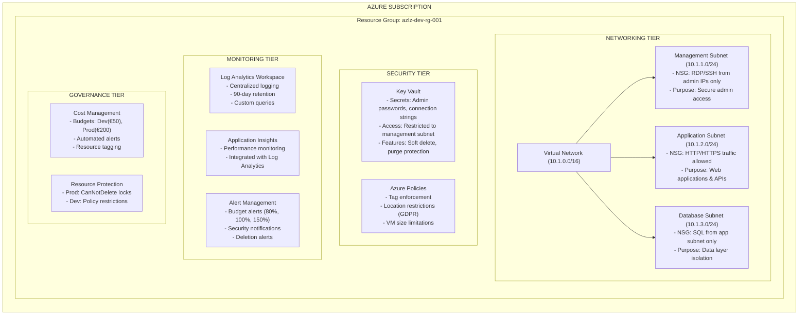

# Azure Landing Zone - Infrastructure Architecture

## Executive Summary

This document describes the enterprise-grade Azure infrastructure architecture implementing a secure, scalable, and compliant landing zone following Microsoft's Cloud Adoption Framework and German GDPR requirements.

## High-Level Architecture


## Network Flow Diagram
```
Internet Traffic Flow:
┌─────────────┐    ┌─────────────────┐    ┌───────────────────┐
│   Internet  │───▶│  Management     │───▶│   Admin Access    │
│   Traffic   │    │  Subnet         │    │   (RDP/SSH Only)  │
└─────────────┘    │  10.1.1.0/24    │    └───────────────────┘
└─────────────────┘
│
▼
┌─────────────────┐    ┌───────────────────┐
│  Application    │───▶│   Web Services    │
│  Subnet         │    │   (HTTP/HTTPS)    │
│  10.1.2.0/24    │    └───────────────────┘
└─────────────────┘
│
▼
┌─────────────────┐    ┌───────────────────┐
│  Database       │───▶│   Data Layer      │
│  Subnet         │    │   (SQL Only)      │
│  10.1.3.0/24    │    └───────────────────┘
└─────────────────┘
│
▼
┌─────────────────┐
│  Log Analytics  │
│  (All Logs)     │
└─────────────────┘
```

## Security Architecture

### Defense in Depth Implementation

1. **Network Level Security**
   - Network Security Groups with least-privilege rules
   - Subnet isolation preventing lateral movement
   - No direct internet access to database tier

2. **Identity and Access Management**
   - Service principal authentication for automation
   - RBAC implementation for human access
   - Key Vault integration for secret management

3. **Data Protection**
   - Encryption at rest for all storage
   - TLS 1.2 minimum for data in transit
   - GDPR-compliant data residency in Germany

4. **Monitoring and Alerting**
   - Comprehensive logging of all activities
   - Real-time security event monitoring
   - Automated incident response triggers

## Technology Stack

### Infrastructure as Code
- **Terraform**: Infrastructure provisioning and management
- **Azure Resource Manager**: Native Azure integration
- **Git**: Version control and change tracking

### Automation and CI/CD
- **Azure DevOps**: Pipeline orchestration
- **GitOps**: Branch-based deployment model
- **Automated Testing**: Validation and compliance checking

---

**Document Version**: 1.0
